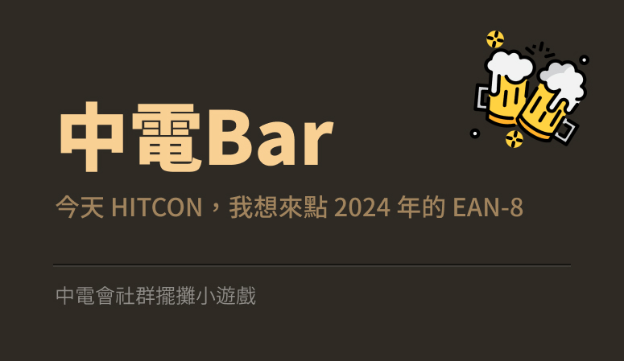

# SCAICT Bar

This website features a mini-game that SCAICT hosted at HITCON 2024, which is now open-sounced for everyone to play, though rewards are no longer being distributed.



## Overview

Players need to recreate a randomly generated EAN-8 barcode using Popsicle sticks, with one side colored black. Originally developed as a Node.js project for HITCON 2024, the game is now open to the public, though rewards are no longer distributed. The project has been open-sourced, and this documentation will guide you through how the game works, how to play it, and how to set it up on your own server.

## Table of Contents

- [SCAICT Bar](#scaict-bar)
  - [Overview](#overview)
  - [Table of Contents](#table-of-contents)
  - [How It Works](#how-it-works)
    - [Front-End](#front-end)
    - [Back-End (For Custom Hosting)](#back-end-for-custom-hosting)
  - [How to Play](#how-to-play)
  - [Setting Up the Game](#setting-up-the-game)
    - [Running the Game as a Static Website](#running-the-game-as-a-static-website)
    - [Hosting the Game with the Original Back-End](#hosting-the-game-with-the-original-back-end)
  - [Modifying the Back-End Code](#modifying-the-back-end-code)
  - [License](#license)
  - [Credits](#credits)
  - [Posters](#posters)

## How It Works

### Front-End

The front-end of the game is a static website that players can access through a web browser. The main elements include:

- **Code Display:** A randomly generated vaild EAN-8 barcode 7 digits numbers is displayed when the player starts the game.
- **Timer:** A timer tracks how long it takes the player to recreate the barcode.
- **QR Code Scanner:** The website uses a QR code scanner to validate the recreated barcode once the player is done.
- **Leaderboard:** The leaderboard displays the top players based on their completion times.

### Back-End (For Custom Hosting)

The back-end is powered by a Node.js server using Express, SQLite3, and Axios. While the public version of the game doesn't require a back-end, if you want to host it yourself and enable custom features like user authentication and leaderboard management, you'll need to work with the back-end code.

Key back-end components:

- **User Authentication:** Players authenticate via Discord to log in and record their game times.
- **Leaderboard Management:** Player data is stored in an SQLite database, and the leaderboard is dynamically updated based on game times.
- **Reward System:** Originally, rewards were issued to players based on their performance. The reward system interacts with an external API to deliver prizes.

## How to Play

1. **Start the Game:**
   - Visit the game website and click "Start Game." 
   - A random EAN-8 barcode will be displayed on the screen.

2. **Recreate the Barcode:**
   - Use Popsicle sticks with one side colored black to recreate the barcode on a flat surface.

3. **Scan the Barcode:**
   - Once you're done, use the on-screen QR code scanner to scan the recreated barcode.

4. **View Results:**
   - If the barcode is correct, your completion time will be recorded.
   - The leaderboard will update with your score.

5. **Check the Leaderboard:**
   - You can view the leaderboard to see how your time compares with other players.

## Setting Up the Game

### Running the Game as a Static Website

1. **Deployment:**
   - Deploy the contents of the `public` folder to a static web hosting service like GitHub Pages, Netlify, or Vercel.

2. **Accessing the Game:**
   - Once deployed, users can access the game directly via the provided URL.

### Hosting the Game with the Original Back-End

1. **Prerequisites:**
   - Ensure you have Node.js and npm installed on your server.
   - Set up a SQLite database if you want to store leaderboard data.

2. **Installation:**
   - Clone the repository to your server.
   - Navigate to the `nodejs` directory and run `npm install` to install the required dependencies.

3. **Configuration:**
   - Create a `.env` file in the root directory and add your environment variables:
     ```bash
     LOGIN_URL=your_discord_login_url
     WHITELISTED_USERS=user1,user2,user3
     ```
   - Modify the code to fit your needs, especially if you want to change how user authentication and leaderboard management work.

4. **Starting the Server:**
   - Run `node app.js` to start the server.
   - The game should now be accessible via `http://localhost:3030` or your server's IP address.

## Modifying the Back-End Code

If you wish to modify the back-end code to suit your needs, here's what you can do:

- **Custom User Authentication:**
  - You can replace the Discord authentication with another method if required.
  - Modify the `/login` and `/callback` routes in `app.js` to implement your custom authentication logic.

- **Leaderboard Customization:**
  - The leaderboard is stored in an SQLite database. If you want to change the leaderboard logic, modify the SQL queries in `app.js`.

- **Reward System:**
  - The reward system is currently set to interact with an external API. You can customize or disable this feature by modifying the `save-time` route.

## License

This project is open-source and available under the [Apache-2.0 License](LICENSE). Feel free to modify and distribute the code as per the license terms.

Enjoy the game!

## Credits

* Made by [Elvis Mao](https://github.com/Edit-Mr/) and [Each Chen](https://github.com/iach526526) from [SCAICT](https://scaict.org)
* [Beer icons created by tulpahn - Flaticon](https://www.flaticon.com/free-icons/beer)
* Special thanks to [HITCON](https://hitcon.org/2024/CMT/) for hosting the event and sponsoring the rewards.

## Posters

 